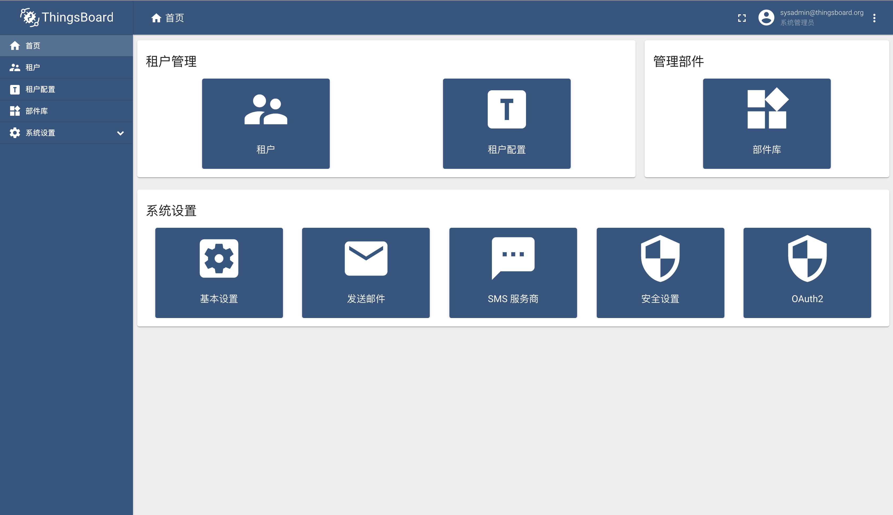
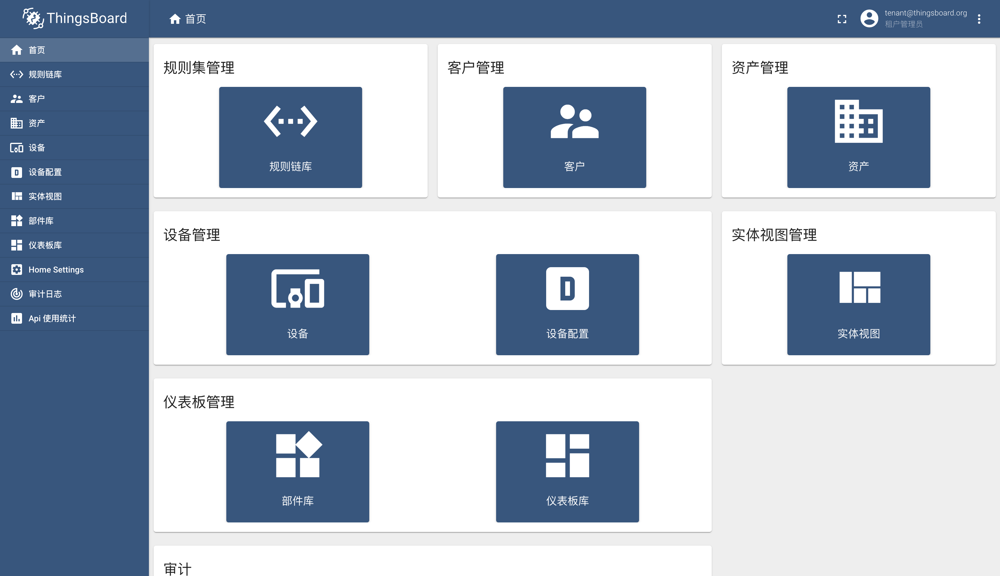
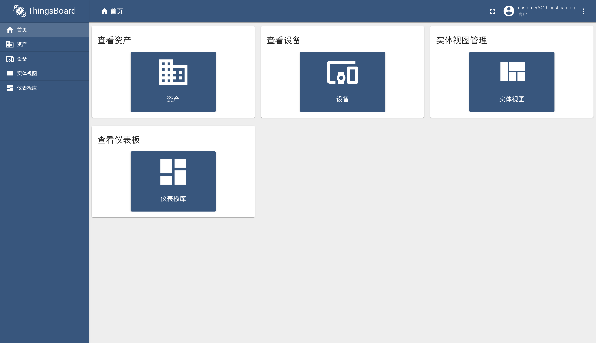

#### 环境准备

- 已经编译且能成功运行的代码环境，可参考前作
- IDE Idea或Eclipse，本文使用Idea
- 支持Html5的浏览器，本文使用Chrome

#### 描述
角色分为三类：系统管理员（SYS_ADMIN）、租户管理员（TENANT_ADMIN）和普通用户（CUSTOMER_USER）。

##### 系统管理员
管理整个系统资源，功能菜单：租户（租户以及租户管理员管理）、租户配置（租户下的隔离设置）、部件库（系统部件库，整个系统可见）和系统设置（基本、邮件、SMS、安全以及OAUTH2）。

##### 租户管理员
管理当前租户资源，功能菜单：规则链库、客户（类似角色以及角色下的用户）、资产、设备、设备配置、实体视图（类似数据库视图）、部件库（系统部件库查看、租户部件库管理）、仪表盘库、HOME Settings（首页定制化展示）、审计日志和API使用统计。

##### 普通用户
查看授权给当前用户所在用户组的资源，功能菜单：资产、设备、实体视图和仪表盘库。

附上[角色功能脑图](功能脑图.xmind)

#### TIPS

- 官方 [user-guide](https://thingsboard.io/docs/user-guide/)

