#### 环境准备

- 已经编译且能成功运行的代码环境，可参考前作
- IDE Idea或Eclipse，本文使用Idea
- Mqtt数据模拟器 或 配置消息生成规则链，本文使用消息生成规则链
- 支持Html5的浏览器，本文使用Chrome
- 参考前作[普通设备](普通设备.md)了解如何创建设备
- 参考前作[规则引擎](规则引擎.md)了解如何创建规则链
- 参考前作[仪表盘](仪表盘.md)了解如何创建别名以及绑定数据源到部件

#### 描述
分析官方[谷仓监控仪表盘](https://demo.thingsboard.io/dashboard/198c2b60-0edc-11e7-942c-bb0136cc33d0?publicId=963ab470-34c9-11e7-a7ce-bb0136cc33d0)，在本地环境复现。

#### 准备
从官方demo中导出仪表盘。
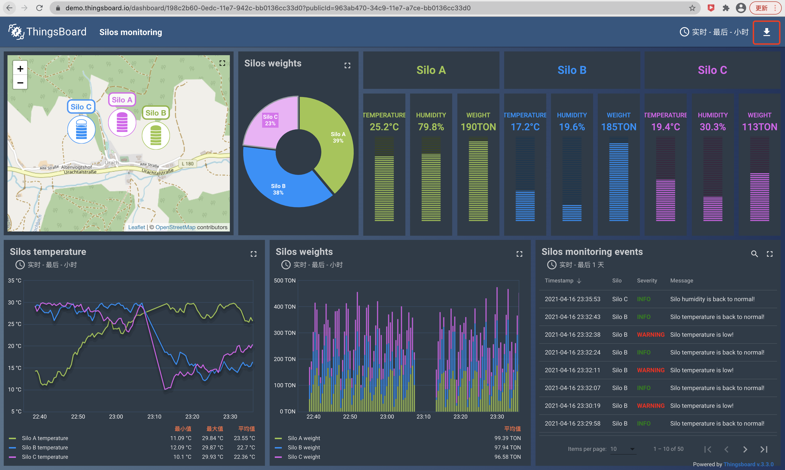

使用`tenant@thingsboard.org`账号登录系统，导入仪表盘。


#### 分析
打开仪表盘进行分析。
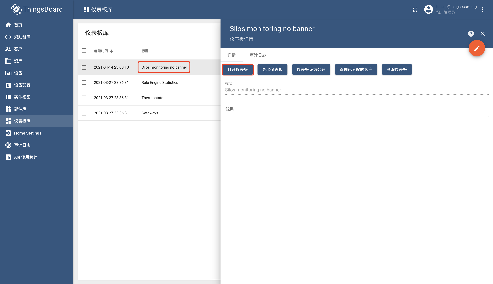

**组件包含**：地图、饼图、静态组件、数字仪表、时序折现图、时序条形图、时序表。


**谷仓设备**：Silo A、 Silo B、Silo C 3台，属性包含：经度（latitude）、纬度（longitude），时序数据包含：重量（weight）、温度（temperature）、湿度（humidity）。
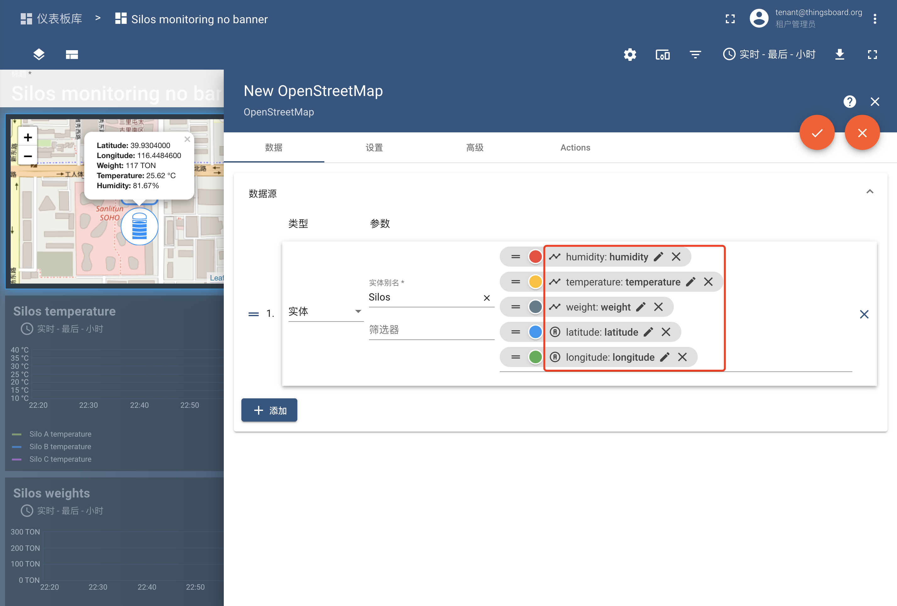

**事件设备**：Silo Dispatcher（右下角监控事件表使用该设备），时序数据包含： 谷仓名（silo）、事件类型（tag）、消息（body）。


**事件**：包含温度过低、温度恢复正常、湿度过低、湿度恢复正常。
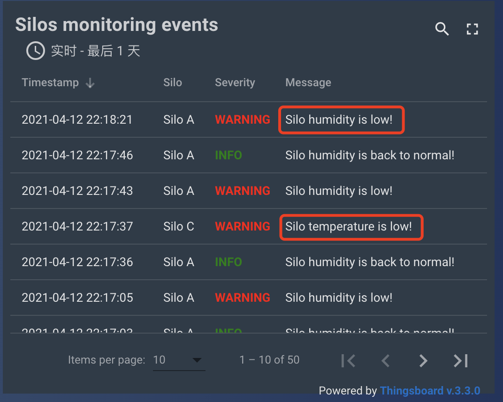

#### 实现

##### 设备配置新建
新建设备配置`silo device profile`，输入名称`silo device profile`,点击`添加`按钮。


编辑告警规则，添加创建报警规则` temperature>40`，级别为`警告`,详情为`Silo temperature is high!`，添加清除报警规则`temperature<=40`，详情为`Silo temperature is back to normal!`，点击右上角`勾`进行保存。
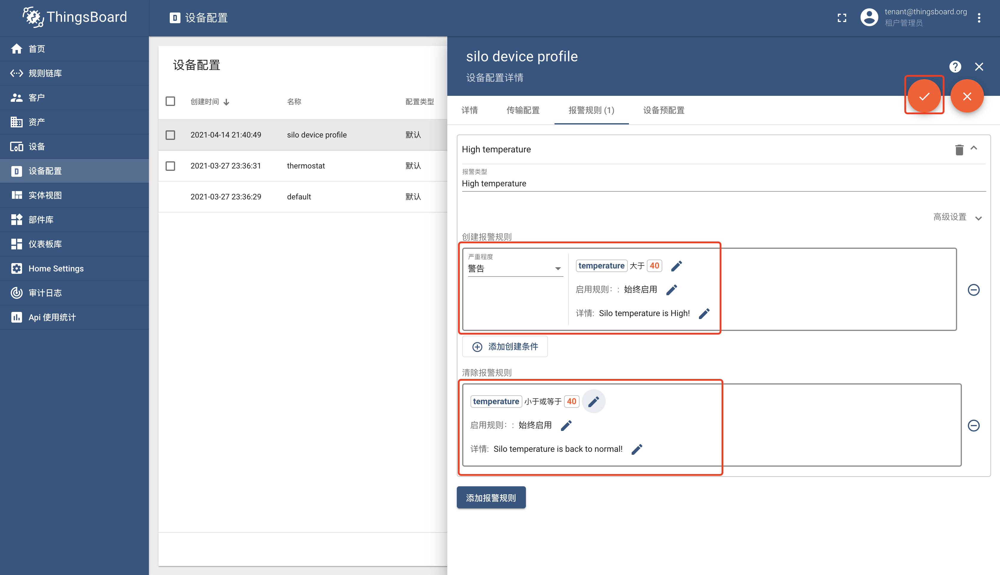


##### 设备新建以及关联
- 新建谷仓设备`Silo A`、`Silo B`、`Silo C`
以`Silo A`举例（`Silo B`、`Silo C`按同样步骤处理），首先新建设备


然后使用[OpenStreetMap](https://www.openstreetmap.org/ 拾取**经纬度坐标**
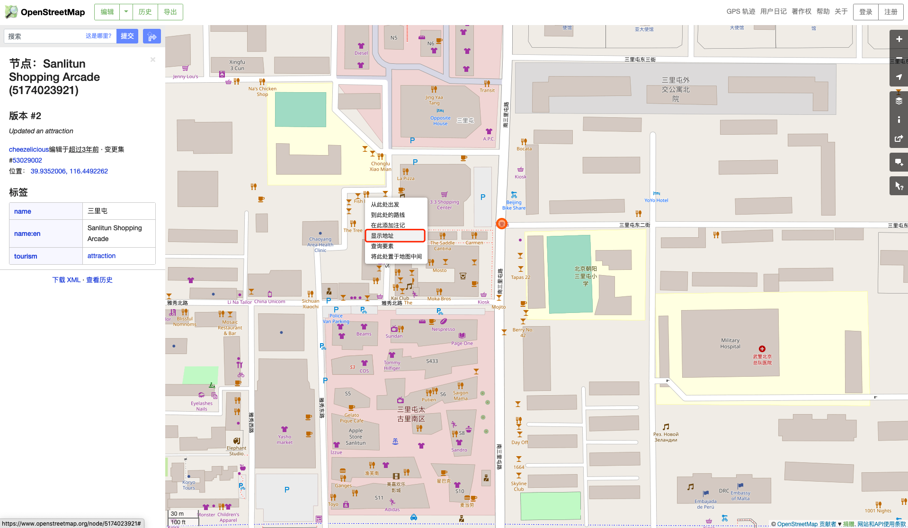

最后设置**服务端属性**`latitude`、`longitude`
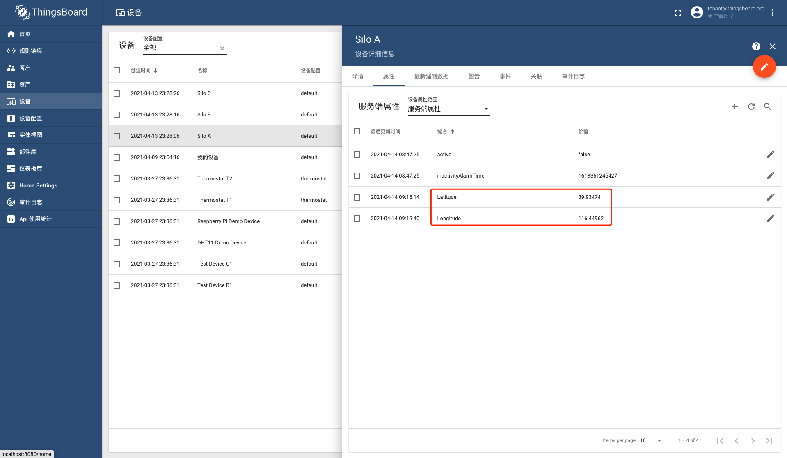

- 新建事件设备`Silo Dispatcher`
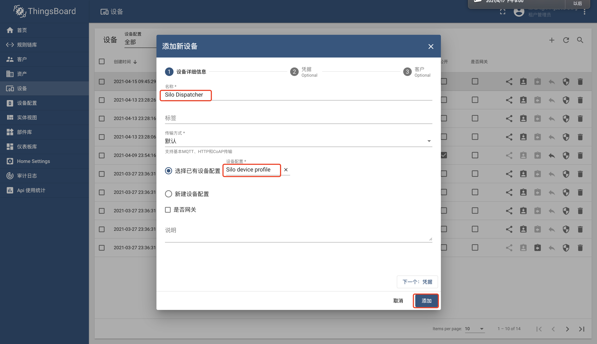
- 新建事件设备与谷仓设备关联
点击设备`Silo Dispatcher`，切换到`关联`tab页，选择方向为`到`,点击右上角`+`号按钮。
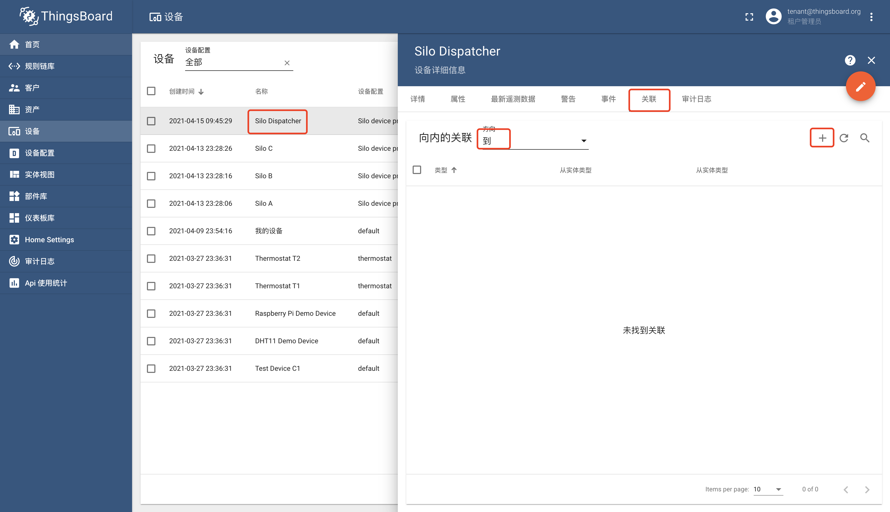
选择从实体类型为`设备`，选择实体`Silo A`、`Silo B`、`Silo C`，点击`添加`按钮。
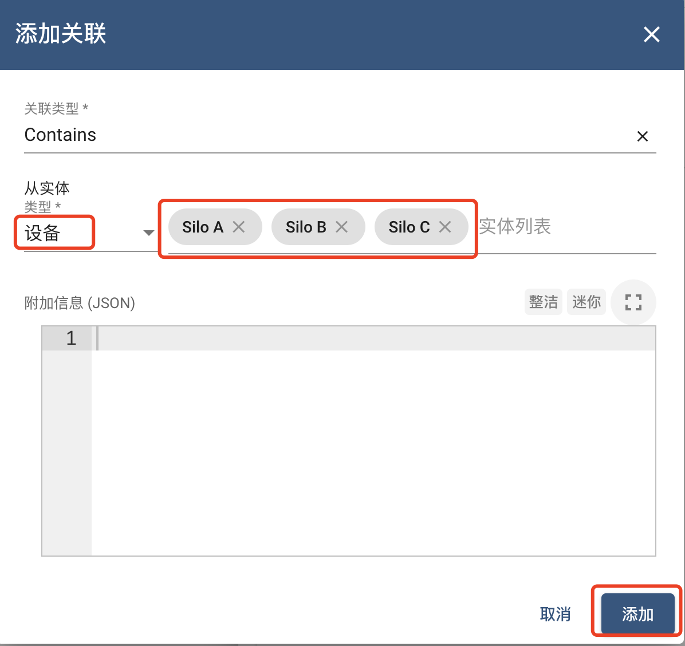

##### 规则链新建
新建规则链`Silo`，输入名称`Silo`,点击`添加`按钮。


使用**规则节点**`generator`模拟谷仓设备`Silo A`、`Silo B`以及`Silo C`时序数据：重量（weight）、温度（temperature）、湿度（humidity），使用**规则节点**`device profile`生成设备警告，使用**规则节点**`change originator`将告警关联到事件设备`Silo dispatcher`，使用**规则节点**`Msg transfrom`将告警消息转换成时序数据：谷仓名（silo）、事件类型（tag）、消息（body），使用**规则节点**`Save timeseries`将时序数据保存。

- 温度（temperature）数据生成脚本
```
var msg = { 
    temperature: Math.round(Math.random()*50*100)/100
    
};
var metadata = { "deviceName": "Silo A" };
var msgType = "POST_TELEMETRY_REQUEST";

return { msg: msg, metadata: metadata, msgType: msgType };
```
湿度（humidity）、重量（weight）数据生成类似。

- 告警关联配置
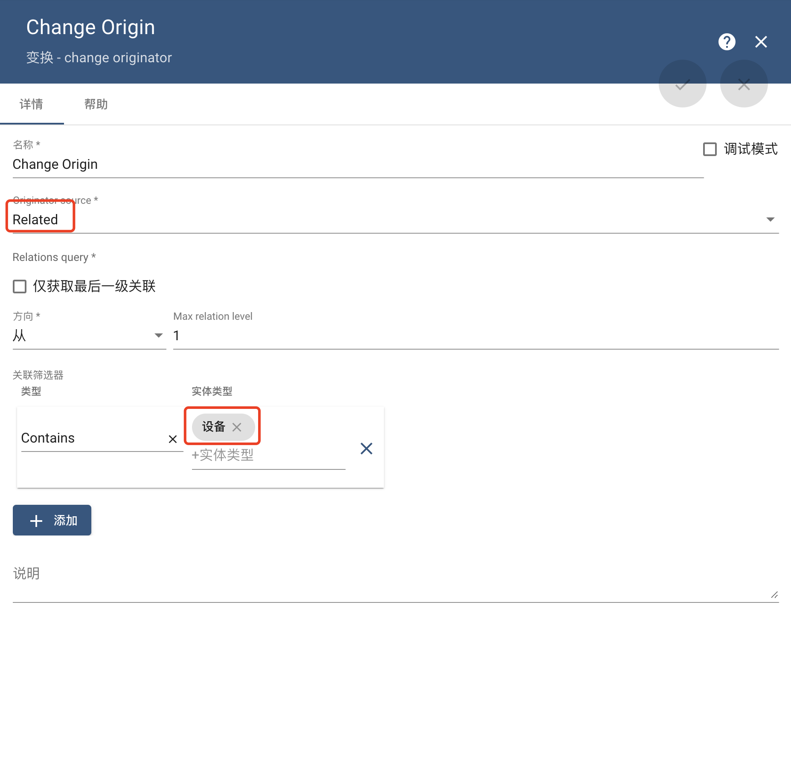

- 告警消息转换脚本
```
var newMsg = {
  "silo": metadata.deviceName,
  "tag":  metadata.isNewAlarm ? "WARNING":"INFO",
  "body": msg.details.data
};
return {msg: newMsg, metadata: metadata, msgType: "POST_TELEMETRY_REQUEST"};
```
最终形成如下规则链
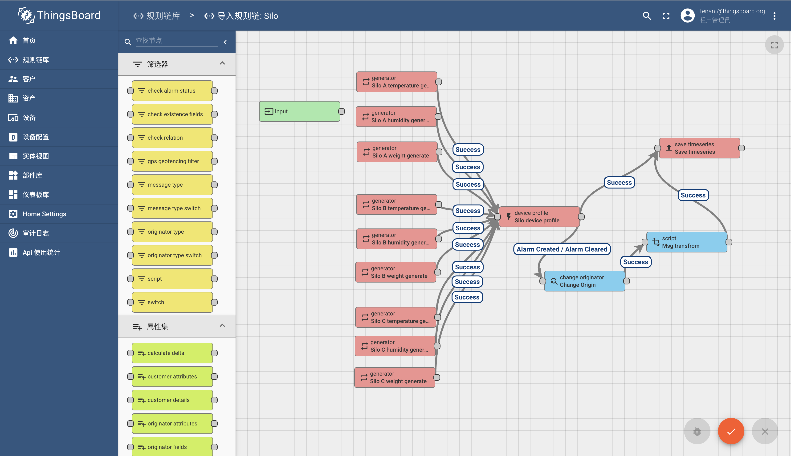

点击右下角` 勾`进行保存。

##### 数据源关联

//todo

#### 效果

//todo gif


#### TIPS

- 已经配置好的[规则链]()、[设备配置文件]()以及[设备列表]()，不建议直接使用