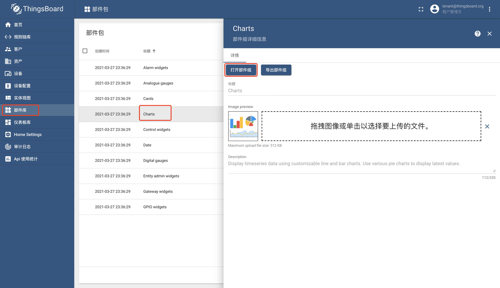
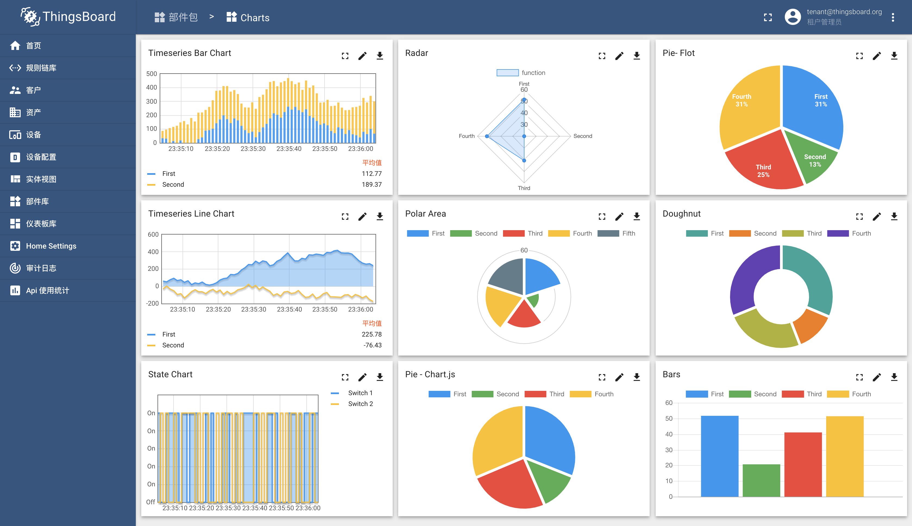

#### 环境准备

- 已经编译且能成功运行的代码环境，可参考前作。
- IDE Idea或Eclipse，本文使用Idea
- 支持Html5的浏览器，本文使用Chrome

#### 描述

部件主要在仪表盘dashboard中使用，形成定制化的页面，每个部件都提供一项具体的功能，例如数据可视化，远程设备控制，警报管理以及显示静态自定义html内容。

#### 部件包

部件包将部件以分组的形式进行管理，3.2版本默认提供13个系统部件组，包含告警组件（Alarm widgets）、模拟仪表（Analogue gauges）、（卡片）Cards、（体表）Charts、（控制）Control widgets、（时间）Date、（数字仪表）Digital gauges、（实体管理）Entity admin widgets、（网关）Gateway widgets、（GPIO）GPIO widgets、（输入）Input widgets、（地图）Maps、（导航）Navigation widgets。

#### 部件

以组件包`charts`为例，使用`tenant@thingsboard.org`账号登录系统，进入部件库页面，双击`charts`包，点击`打开部件组`按钮。

可以看到该包下的所有部件。

//todo

#### TIPS

- 官方 [部件库介绍](https://thingsboard.io/docs/user-guide/contribution/widgets-development/#introduction)
- //todo

