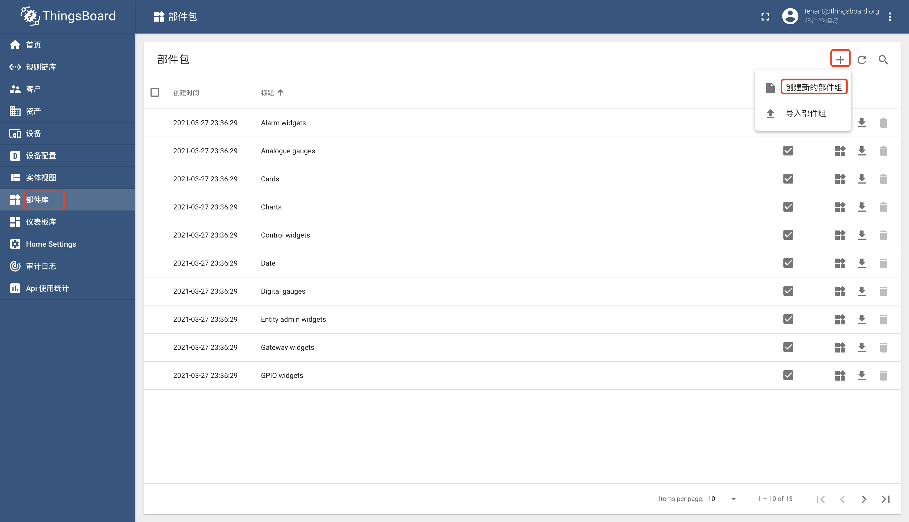
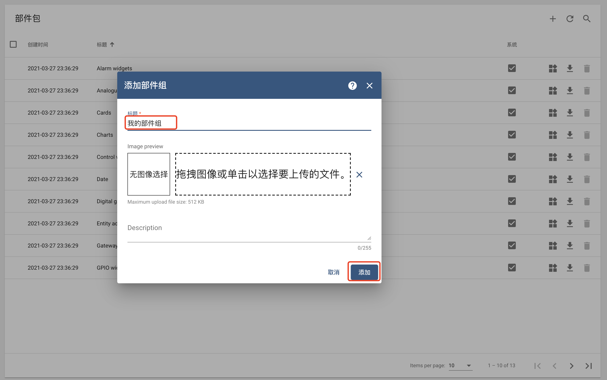
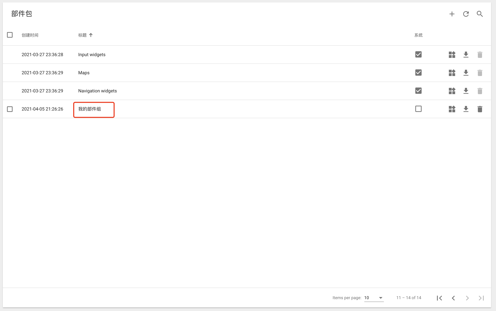
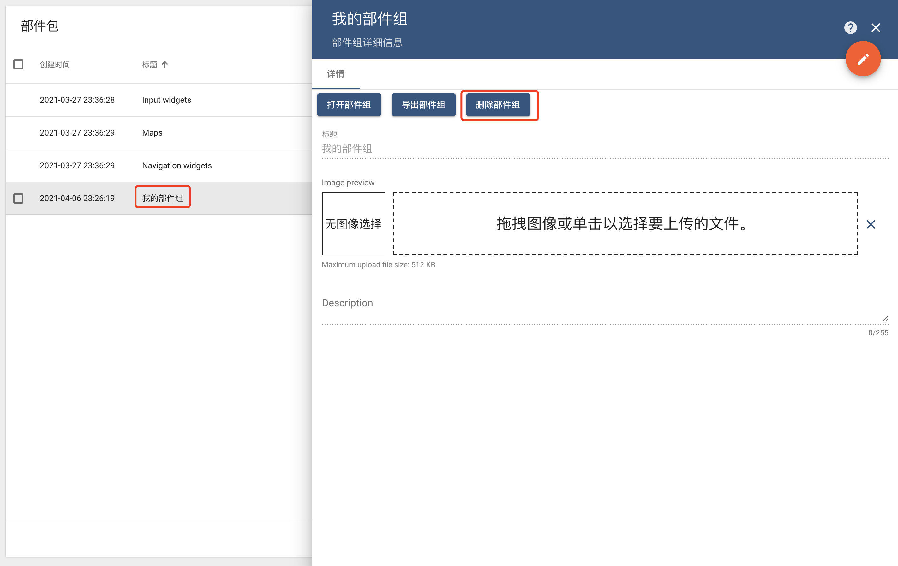

#### 环境准备

- 已经编译且能成功运行的代码环境，可参考前作。
- IDE Idea或Eclipse，本文使用Idea
- 支持Html5的浏览器，本文使用Chrome

#### 描述

部件在仪表盘Dashboard中使用，每个部件都提供一项具体的功能，例如数据可视化、远程控制、警报管理以及显示静态自定义html内容。

#### 部件包

部件包将部件以分组的形式进行管理，3.2版本默认提供13个系统部件组，包含告警组件（Alarm widgets）、模拟仪表（Analogue gauges）、（卡片）Cards、（体表）Charts、（控制）Control widgets、（时间）Date、（数字仪表）Digital gauges、（实体管理）Entity admin widgets、（网关）Gateway widgets、（GPIO）GPIO widgets、（输入）Input widgets、（地图）Maps、（导航）Navigation widgets。

#### 部件组新建
运行程序，使用`tenant@thingsboard.org`账号登录系统，点击左侧菜单`部件库`，点击右上角`+`号，选择`创建新的部件组`。

输入标题`我的部件组`，选择图像（图标，可选），填写描述（可选），点击`添加`按钮。

在列表中可以找到部件组`我的部件组`，`我的部件组`仅供当前租户使用，如果要新建所有租户都能使用的部件组，需要使用管理员账号（比如`sysadmin@thingsboard.org`）进行新建。

#### 部件组删除
通过`删除部件组`按钮，可以删除部件组，租户管理员只能删除本租户下的部件组。

#### 部件
部件当前有5种类型：
- Latest最新值，数据来源是实体（什么是实体？见TIPS）的属性（Attribute）或时间序列（Timeseries）
- Timeseries时间序列，显示选定时间段的历史值或特定时间窗口中的最新值，数据来源必须是时间序列（Timeseries）
- RPC，向设备发送RPC命令，并处理设备RPC回复，需要绑定具体设备
- Alarm警报，在特定时间窗口显示警报
- Static静态，显示静态的可定制html内容，不使用任何数据源

以部件包`charts`为例，进入部件库页面，双击`charts`包，点击`打开部件组`按钮。

可以看到该包下的所有部件。

#### TIPS
- 部件组以及部件都可以导入导出，格式为json
- 官方 [部件库使用](https://thingsboard.io/docs/user-guide/ui/widget-library/#introduction) [实体与关联介绍](https://thingsboard.io/docs/user-guide/entities-and-relations/)
- 部件开发见 [组件扩展](组件扩展.md)

